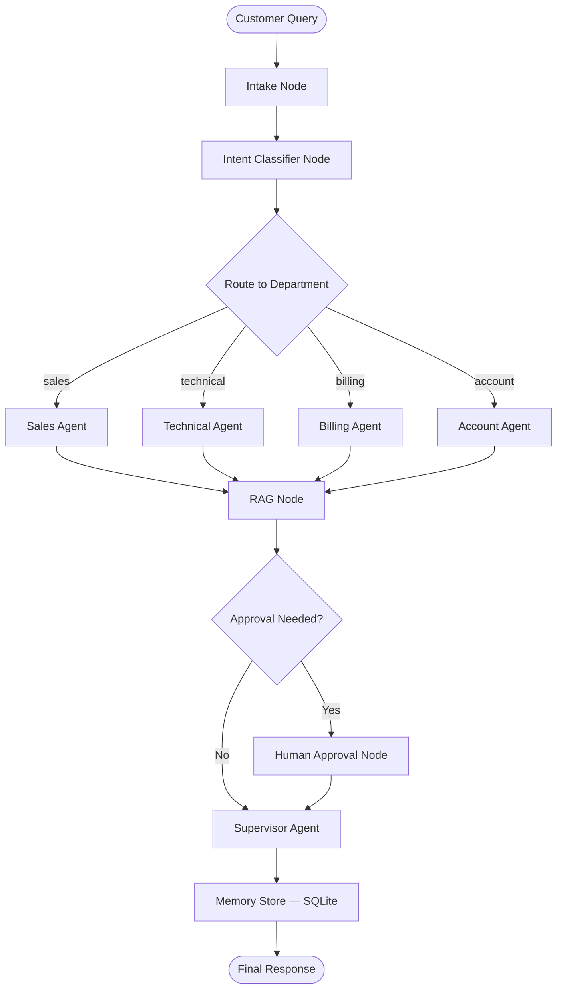
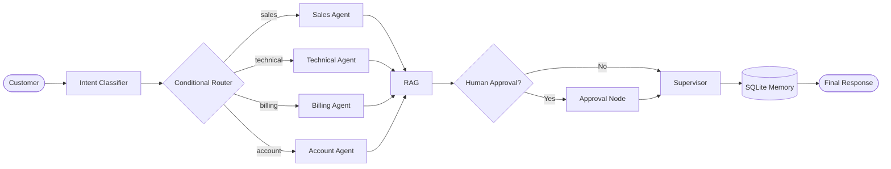

# LangGraph Workflow Design — AI Powered Customer Support Automation

## 1. Workflow Overview

The customer support automation system is designed as a **stateful, multi-step
LangGraph workflow** that processes every incoming customer query through a
deterministic pipeline of specialised nodes. Each node reads from and writes to a
shared `SupportState` TypedDict, ensuring that every downstream node has full
visibility of everything that happened upstream.

### High-Level Flow

```
Customer Query
      │
      ▼
┌─────────────┐
│  Intake Node │  ← Captures query, assigns conversation_id
└─────┬───────┘
      │
      ▼
┌──────────────────┐
│ Intent Classifier │  ← LLM + keyword fallback → Sales/Technical/Billing/Account
└─────┬────────────┘
      │
      ▼
┌──────────────────┐
│ Conditional Router│  ← LangGraph conditional_edge routes to department
└─────┬────────────┘
      │
      ├──► Sales Agent
      ├──► Technical Agent
      ├──► Billing Agent
      └──► Account Agent
              │
              ▼
      ┌──────────────┐
      │   RAG Node    │  ← Retrieves relevant docs from ChromaDB / FAISS
      └──────┬───────┘
             │
             ▼
      ┌──────────────────┐
      │ Human Approval?  │  ← Conditional: refund / cancel / closure / compensation / escalation
      └──────┬───────────┘
             │  yes                    │  no
             ▼                         ▼
      ┌──────────────┐         ┌──────────────┐
      │ Approval Node│         │              │
      └──────┬───────┘         │              │
             │                  │              │
             ▼                  ▼              │
      ┌──────────────────┐                    │
      │ Supervisor Agent │  ◄─────────────────┘
      └──────┬───────────┘
             │
             ▼
      ┌──────────────┐
      │ Memory Store │  ← Persist to SQLite
      └──────┬───────┘
             │
             ▼
      ┌──────────────┐
      │ Final Output │
      └──────────────┘
```

## 2. Node Descriptions

| # | Node Name | Responsibility |
|---|-----------|---------------|
| 1 | **intake_node** | Receives the raw customer query, assigns a unique `conversation_id`, records the customer name, and initialises the state. |
| 2 | **intent_classifier_node** | Calls the LLM to classify the query into one of four intents: `sales`, `technical`, `billing`, `account`. Falls back to a keyword-based classifier if the LLM response is ambiguous. |
| 3 | **route_to_department** | A LangGraph **conditional edge** function (not a node). Reads `state["intent"]` and returns the key for the correct department node. |
| 4 | **sales_agent_node** | Handles product information and pricing queries. Has its own system prompt optimised for sales conversations. |
| 5 | **technical_agent_node** | Handles technical issues, bug reports, and how-to questions. System prompt includes technical troubleshooting guidance. |
| 6 | **billing_agent_node** | Handles invoicing, payment, refund, and subscription queries. System prompt focuses on billing policies. |
| 7 | **account_agent_node** | Handles password resets, account changes, account closures. System prompt focuses on account management. |
| 8 | **rag_node** | Queries ChromaDB (or FAISS) using Sentence-Transformer embeddings to retrieve the most relevant chunks from company documents. Injects the context into the state for the department agent to use. |
| 9 | **check_approval_needed** | A conditional edge function. Inspects `state["intent"]` and the query content for keywords: refund, cancellation, closure, compensation, escalation. Returns `"approval"` or `"supervisor"`. |
| 10 | **human_approval_node** | Pauses the workflow and waits for human approval (simulated). Sets `state["approval_status"]` to `approved` or `rejected`. |
| 11 | **supervisor_node** | Reviews the draft response for correctness, professional tone, hallucinations, missing info, and safety. May rewrite the response. Adds `supervisor_notes`. |
| 12 | **memory_node** | Persists the conversation (query, response, intent, department, timestamps) into SQLite. Also retrieves prior conversations for the same customer if memory recall is requested. |
| 13 | **final_response_node** | Packages the final approved response and returns it to the caller. |

## 3. Edge Map

| From | To | Type |
|------|----|------|
| START | intake_node | Normal |
| intake_node | intent_classifier_node | Normal |
| intent_classifier_node | route_to_department | Conditional |
| route_to_department → sales | sales_agent_node | Conditional branch |
| route_to_department → technical | technical_agent_node | Conditional branch |
| route_to_department → billing | billing_agent_node | Conditional branch |
| route_to_department → account | account_agent_node | Conditional branch |
| sales_agent_node | rag_node | Normal |
| technical_agent_node | rag_node | Normal |
| billing_agent_node | rag_node | Normal |
| account_agent_node | rag_node | Normal |
| rag_node | check_approval_needed | Conditional |
| check_approval_needed → yes | human_approval_node | Conditional branch |
| check_approval_needed → no | supervisor_node | Conditional branch |
| human_approval_node | supervisor_node | Normal |
| supervisor_node | memory_node | Normal |
| memory_node | final_response_node | Normal |
| final_response_node | END | Normal |

## 4. Design Decisions

### Why LangGraph over plain LangChain?

LangGraph provides **explicit graph-based control flow** with conditional edges,
cycles, and human-in-the-loop interrupts — all of which are required by this
assignment. Plain LangChain chains are linear and do not natively support
branching or pausing for human approval.

### Why Conditional Edges instead of a Router Chain?

LangGraph conditional edges are **deterministic routing functions** that inspect
the current state and return a string key. This is more reliable and testable
than asking the LLM to decide routing at runtime.

### Why RAG after the Department Agent?

The department agent first generates a draft response using its specialised
system prompt. The RAG node then enriches that draft with retrieved document
context. This two-step approach ensures:
1. The agent's domain expertise shapes the response structure.
2. Factual accuracy is grounded in company documents.

### Why Supervisor after Human Approval?

Even after human approval, the supervisor performs a final quality check. This
ensures consistency and catches any issues the human approver might miss.

## 5. Mermaid Workflow Diagram



## 6. Horizontal Mermaid Diagram (LR)


